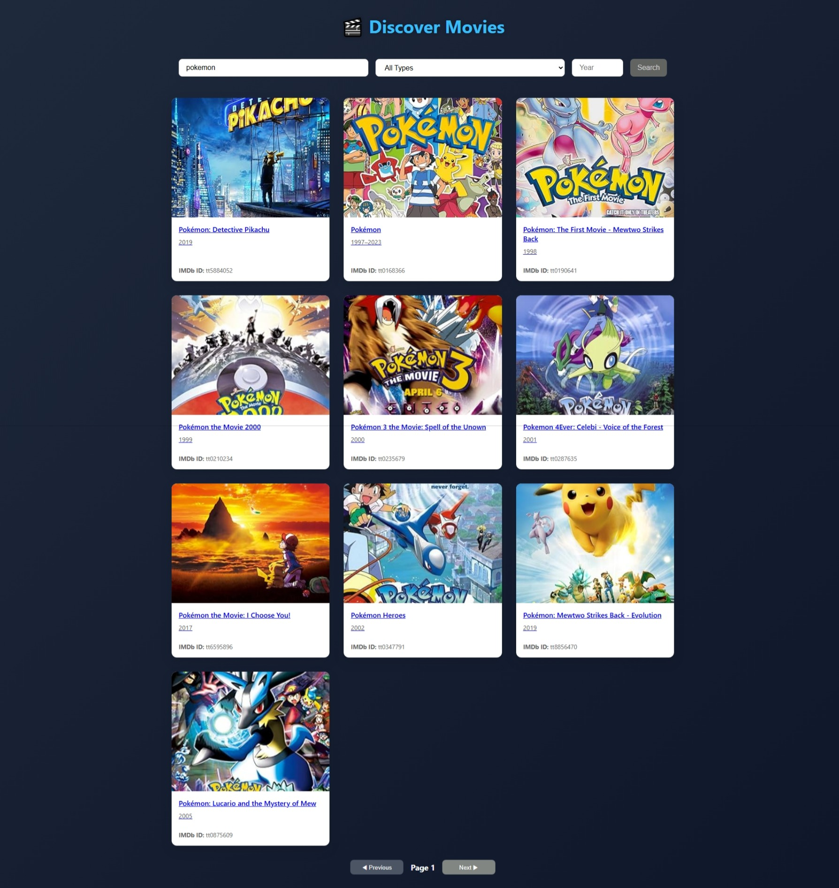
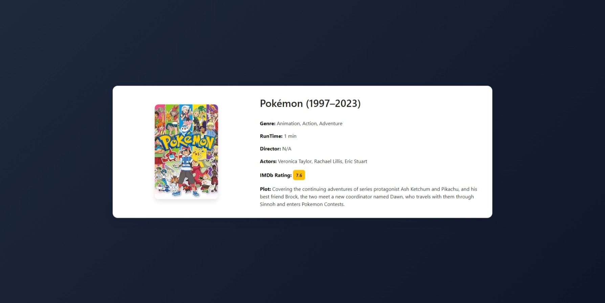

# 🎬 Movie Stack

A visually engaging and fully responsive movie discovery application built with **React 19 + TypeScript** and powered by the **OMDb API**.  
Users can effortlessly search for movies, TV series, or episodes, filter results by year or content type, and dive into detailed pages showing posters, ratings, genres, cast, and more.

Designed with a clean UI, smooth animations (via **Framer Motion**), and built using modern architecture (**Redux Toolkit**, **SCSS Modules**, **Vite**), this SPA delivers a fast and polished user experience — optimized for both desktop and mobile users.

Ideal for showcasing frontend development skills in real-world, API-integrated project scenarios.


---

## ⚙️ Technologies Used

-  React 19 + TypeScript  
- Vite (for fast bundling)  
- Redux Toolkit + AsyncThunk  
- SCSS Modules  
- React Router DOM  
- Framer Motion  
- OMDb API

---

## Getting Started

> Follow these steps to run the project locally.

### 🔧 Requirements

- Node.js (v16 or higher)
- npm

---

### 🛠️ Installation Steps

```bash
# 1. Clone the project
git clone https://github.com/senaGitHub/movie-stack.git
cd movie-stack

# 2. Install dependencies
npm install

# 3. Install Vite globally
npm install -g vite

# 4. Install React Router (if not already)
npm install react-router-dom

# 5. Starting project
npm run dev
```
## 📸 Screenshots

| Home Page | Movie Detail |
|-----------|--------------|
|  |  |


## 📄 License

This project is licensed under the **MIT License**.  
Feel free to **use**, **modify**, and **share** it for any purpose — personal or commercial.


